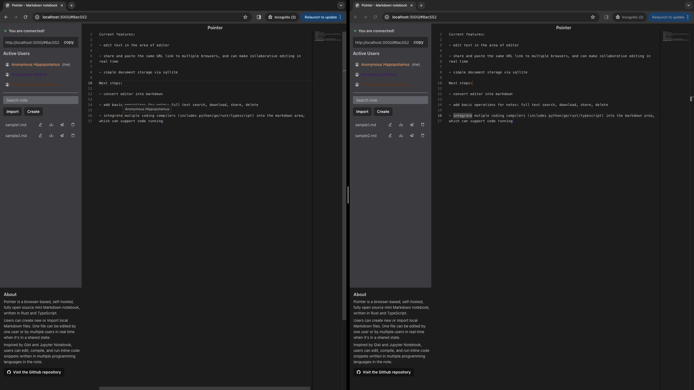

# Pointer

Pointer is a browser-based, self-hosted, fully open source mini Markdown notebook, written in Rust and TypeScript.

Users can create new or import local Markdown files. One file can be edited by one user or by multiple users in real time when it's in a shared state.

Inspired by Gist and Jupyter Notebook, users can edit, compile, and run inline code snippets written in multiple programming languages in the note.



## Features

Current features:

- edit text in the area of editor

- share and paste the same URL link to multiple browsers, and can make collaborative editing in real time

- simple document storage via sqllite

Next steps:

- convert editor into markdown

- add basic operations for notes: full text search, download, share, delete

- integrate mutiple coding compilers (includes python/go/rust/typescript) into the markdown area, which can support code running

## How to run it locally

1. use prebuilt docker image

```
# pull image from Docker Hub
docker pull patrickpro2/pointer

# run the container
docker run --name pointer -it --rm -d -p 3030:3030 patrickpro2/pointer
```

2. build docker image locally

```
# create docker image
docker built -t pointer .

# run the container
docker run --name pointer -it --rm -d -p 3030:3030 patrickpro2/pointer
```

3. deploy manually

Attention: rust and wasm should be installed before.

```
# build WebAssembly
wasm-pack build --target web wasm

# install dependencies for React
npm install

# run rust backend
cargo run

# run react frontend
npm run dev
```

Visit `localhost:3030` to see the current view of pointer.

## System design diagram (TBD)

## Workplace

1. [UI design](https://www.figma.com/file/01QqRzOoEJUCsGqrhdH9MQ/pointer-ui?type=design&mode=design&t=D62E2cHv0dzMgHZN-1)

2. [Agile board](https://github.com/users/dx-han/projects/2)
